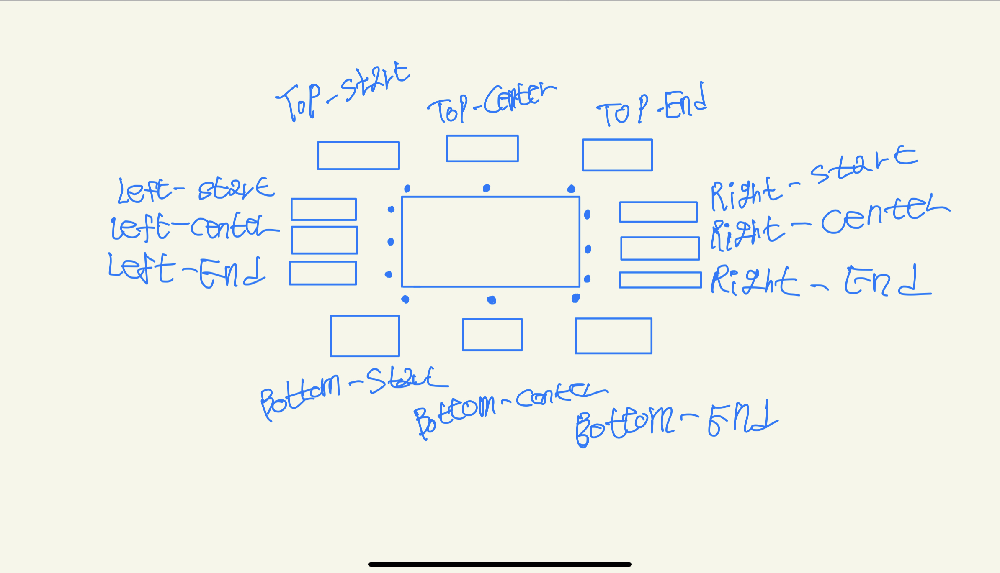

# Pui-Placer

- 기준 엘리먼트와 배치할 엘리먼트의 절대 좌표를 비교하여 배치할 엘리먼트의 절대 좌표값을 계산한다.

- `ViewPort` 와 충돌시 손해량(pixel)도 계산한다.

## Plan



## Interface

`placeAt`
```ts
interface PlaceAtParameters {
    source: HTMLElement | null;
    target: HTMLElement | null;
    placement: PUI_VALID_PLACEMENTS | '';
}

interface PlaceAtReturns {
    damage: number;
    top: number;
    left: number
}

interface PlaceAtSubFunctionParameters {
    windowIWidth: number;
    windowIHeight: number;
    sourceRect: DOMRect;
    targetRect: DOMRect;
}

type PlaceAt = ({source = null, target = null, placement = ''}: PlaceAtParameter) => PlaceAtReturns | null;
type PlaceAtSubFunction = ({windowIWidth, windowIHeight, sourceRect, targetRect}: PlaceAtSubFunctionParameters) => PlaceAtReturns;
```


## Reference

- [popper.js](https://popper.js.org/)
