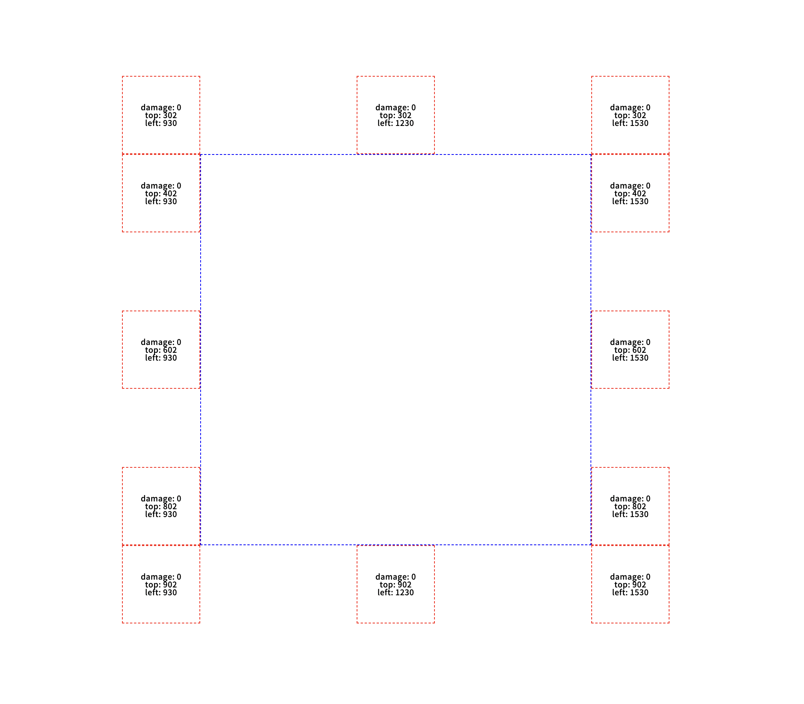

# Pui-Placer

- 기준 엘리먼트와 배치할 엘리먼트의 절대 좌표를 비교하여 배치할 엘리먼트의 절대 좌표값을 계산한다.

- `ViewPort` 와 충돌시 손해량(pixel)도 계산한다. 계산된 손해량은 툴팁, 팝오버와 같은 요소를 모든 충돌상황에서 가장 손해량이 적은 곳에 배치할 용도로 이용할 수 있다.

## Plan
|PLAN|RESULT|
|:---:|:---:|
|||


## Interface

```ts
interface PlaceAtParameters {
    source: HTMLElement | null;
    target: HTMLElement | null;
    placement: PUI_VALID_PLACEMENTS | '';
}

interface PlaceAtReturns {
    damage: number;
    top: number;
    left: number
}

interface PlaceAtSubFunctionParameters {
    windowIWidth: number;
    windowIHeight: number;
    sourceRect: DOMRect;
    targetRect: DOMRect;
}

interface Operands {
    top: number;
    bottom: number;
    left: number;
    right: number;
    windowIWidth: number;
    windowIHeight: number;
}

type PlaceAt = ({source = null, target = null, placement = ''}: PlaceAtParameter) => PlaceAtReturns | null;
type PlaceAtSubFunction = ({windowIWidth, windowIHeight, sourceRect, targetRect}: PlaceAtSubFunctionParameters) => PlaceAtReturns;
type TaregtInViewportCheckerFn = ({ top, bottom, left, right, windowIWidth, windowIHeight }: Operands) => boolean;
type DamageCheckerFn = ({ top, bottom, left, right, windowIWidth, windowIHeight }: Operands) => number;
```

## Reference

- [popper.js](https://popper.js.org/)
